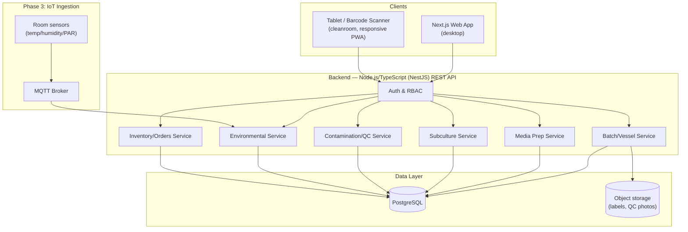

# Architecture Overview

## 1. Core Modules

| Module | Responsibility |
|---|---|
| **Batch & Container Tracking** | Barcode/QR-identified vessels, self-referencing lineage from Stage I → IV, subculture events, audit trail |
| **Media Preparation** | Recipe builder, auto-calculated chemical quantities, autoclave logging, raw-chemical inventory deduction |
| **Cleanroom & Workstation** | Laminar flow hood session logging, split-ratio capture, multiplication-rate yield projection |
| **Contamination & QC** | Contamination event logging by type/vessel/operator/media/location, root-cause analytics, discard/mortality tracking |
| **Environmental Monitoring** | Manual or IoT-sourced growth room readings (temp, photoperiod, PAR, humidity) |
| **Inventory & Orders** | Raw material stock with low-stock alerts, sales order → dispatch fulfillment linked to acclimatized batches |
| **Identity & RBAC** | Users, roles, permissions, audit logging of who-did-what |

## 2. System Diagram

## 3. Roles & Permissions (RBAC)

| Capability | Admin | Lab Manager | Lab Technician | Media Prep Staff |
|---|:---:|:---:|:---:|:---:|
| Manage users/roles | ✅ | ❌ | ❌ | ❌ |
| Configure recipes, chemicals, workstations | ✅ | ✅ | ❌ | ✅ (recipes/chemicals only) |
| Create/log batches & vessels | ✅ | ✅ | ✅ | ❌ |
| Run subculture sessions (scan in/out) | ✅ | ✅ | ✅ | ❌ |
| Prepare media batches, log autoclave runs | ✅ | ✅ | ❌ | ✅ |
| Log contamination / discard events | ✅ | ✅ | ✅ | ❌ |
| View QC analytics dashboard | ✅ | ✅ | ✅ (read-only) | ❌ |
| Log environmental readings | ✅ | ✅ | ✅ | ❌ |
| Manage inventory & place purchase orders | ✅ | ✅ | ❌ | ✅ (raw chemicals only) |
| Manage sales orders & dispatch | ✅ | ✅ | ❌ | ❌ |

Enforced server-side per-endpoint (see [API spec](03-api-specification.md)); the frontend hides unavailable actions but is not the trust boundary.

## 4. Key Design Decisions

- **Self-referencing lineage** — both `batches` and `vessels` carry a nullable `parent_*_id` pointing at themselves, so the full initiation → acclimatization tree is a single recursive query (Postgres `WITH RECURSIVE`), rather than a bespoke tree table.
- **Vessel is the unit of physical truth; batch is the logical lineage group.** A subculture session can fan one input vessel out into N output vessels (the split ratio), each a new vessel row referencing the same batch (or a new child batch when stage changes).
- **Media batches are inventory-backed.** Creating a media batch deducts stock from `chemicals` via `inventory_transactions`, giving a full audit trail and enabling low-stock alerts without duplicating quantity fields.
- **Contamination events denormalize media batch, workstation, and location at time of detection** so root-cause analytics don't depend on the vessel's current (possibly since-discarded) state.
- **Barcode/QR codes encode only an opaque ID** (`vessel_id`, `media_batch_id`, etc.) — all lookups resolve server-side, so labels never need reprinting when data changes.
- **Multi-tenant via a shared database, not database-per-tenant.** Every table carries an `organization_id` FK (see [`docs/02-database-schema.md`](02-database-schema.md)); every service method scopes both reads and writes by the caller's `organizationId` from the JWT. Cheaper to run and simpler to evolve into from a single-tenant start than provisioning a database per customer, at the cost of needing that scoping to be correct everywhere — there's no database-level wall between tenants' data, only the application's discipline about the `WHERE` clause.
