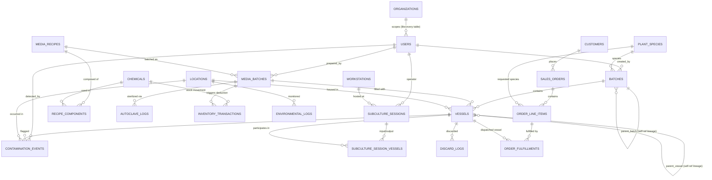

# Database Schema (ERD)

PostgreSQL. All primary keys `UUID DEFAULT gen_random_uuid()` unless noted. All tables carry `created_at` / `updated_at` timestamps (omitted below for brevity).

**Multi-tenancy:** shared database, not database-per-tenant. Every table below except `organizations` itself carries an `organization_id` FK, denormalized directly onto the table rather than left to be derived through joins — every query filters `WHERE organization_id = $1` directly, so a forgotten join can't silently leak another tenant's rows. Omitted from the individual table listings below and the ERD (21 identical relations would make the diagram unreadable) — assume it's there. `email` on `users` stays globally unique rather than unique-per-tenant, so login can resolve straight from an email/password pair without first having to resolve which organization to check against.

## 1. Entity Relationship Diagram



## 2. Table Definitions

### Tenancy

**`organizations`**
| Column | Type | Notes |
|---|---|---|
| id | uuid PK | |
| name | text | |
| slug | text unique | |

### Identity

**`users`**
| Column | Type | Notes |
|---|---|---|
| id | uuid PK | |
| organization_id | uuid FK → organizations | |
| name | text | |
| email | text unique | globally unique, not per-org — see the multi-tenancy note above |
| password_hash | text | |
| role | enum(`admin`,`lab_manager`,`lab_technician`,`media_prep_staff`) | |
| active | boolean default true | |

### Batch & Container Tracking

**`plant_species`**
| id PK | name | scientific_name | notes |

**`batches`** — logical lineage group
| Column | Type | Notes |
|---|---|---|
| id | uuid PK | printed as batch barcode |
| parent_batch_id | uuid FK → batches.id, nullable | self-reference; null = initiation batch |
| species_id | uuid FK → plant_species | |
| stage | enum(`I_initiation`,`II_multiplication`,`III_rooting`,`IV_acclimatization`) | |
| source_type | enum(`seed`,`explant`,`tissue`) | only set when parent_batch_id is null |
| status | enum(`active`,`completed`,`discarded`) | |
| created_by | uuid FK → users | |

**`vessels`** — physical unit of truth (jar/tray/tube)
| Column | Type | Notes |
|---|---|---|
| id | uuid PK | printed as QR/barcode label |
| barcode | text unique | human-scannable code, may differ from id |
| batch_id | uuid FK → batches | |
| parent_vessel_id | uuid FK → vessels.id, nullable | self-reference lineage at vessel granularity |
| media_batch_id | uuid FK → media_batches, nullable | |
| location_id | uuid FK → locations | current physical location |
| vessel_type | enum(`jar`,`tray`,`tube`,`bag`) | |
| status | enum(`active`,`contaminated`,`discarded`,`transferred_greenhouse`) | |

### Cleanroom & Subculturing

**`workstations`**
| id PK | name | location_id FK | hood_type | last_certified_date |

**`subculture_sessions`** — one laminar-flow-hood session
| Column | Type | Notes |
|---|---|---|
| id | uuid PK | |
| workstation_id | uuid FK → workstations | |
| operator_id | uuid FK → users | |
| started_at / ended_at | timestamptz | |
| split_ratio | text | e.g. `1:4` |
| notes | text | |

**`subculture_session_vessels`** — join table capturing fan-in/fan-out
| session_id FK | vessel_id FK | direction enum(`input`,`output`) |

### Media Preparation

**`chemicals`** — raw stock (salts, PGRs, vitamins, gelling agents, sugars)
| Column | Type | Notes |
|---|---|---|
| id | uuid PK | |
| name | text | |
| category | enum(`macro_salt`,`micro_salt`,`vitamin`,`pgr`,`gelling_agent`,`sugar`,`other`) | |
| stock_concentration | numeric | e.g. mg/mL for liquid stocks |
| unit | text | |
| current_stock_qty | numeric | decremented via `inventory_transactions` |
| reorder_threshold | numeric | drives low-stock alerts |
| supplier | text | |

**`media_recipes`**
| id PK | name | basal_media_type (`MS`,`WPM`,`B5`,…) | target_ph | gelling_agent_id FK → chemicals | created_by FK → users |

**`recipe_components`**
| recipe_id FK | chemical_id FK | concentration | unit | — target-volume quantities are computed at prep time: `qty = concentration × target_volume / stock_concentration` |

**`media_batches`**
| Column | Type | Notes |
|---|---|---|
| id | uuid PK | printed as media bottle barcode |
| recipe_id | uuid FK → media_recipes | |
| target_volume_l | numeric | |
| final_ph | numeric | |
| prepared_by | uuid FK → users | |
| prepared_at | timestamptz | |
| expiration_date | date | |
| status | enum(`available`,`depleted`,`expired`,`failed_autoclave`) | |

**`autoclave_logs`**
| id PK | media_batch_id FK | cycle_date | temperature_c | pressure_kpa | duration_min | operator_id FK → users | result enum(`pass`,`fail`) |

**`inventory_transactions`**
| id PK | chemical_id FK | transaction_type enum(`deduction`,`receipt`,`adjustment`) | quantity | related_media_batch_id FK nullable | operator_id FK | occurred_at |

### Contamination & QC

**`contamination_events`**
| Column | Type | Notes |
|---|---|---|
| id | uuid PK | |
| vessel_id | uuid FK → vessels | |
| contamination_type | enum(`bacterial`,`fungal`,`viral`,`unknown`,`mixed`) | |
| media_batch_id | uuid, denormalized snapshot | root-cause analytics survive vessel discard |
| workstation_id | uuid, denormalized snapshot | |
| location_id | uuid FK → locations | |
| detected_by | uuid FK → users | |
| detected_at | timestamptz | |
| root_cause_notes | text | |
| action_taken | enum(`isolated`,`discarded`,`treated`) | |

**`discard_logs`**
| id PK | vessel_id FK | reason enum(`contamination`,`mortality`,`quality`,`end_of_life`) | stage_at_discard | discarded_by FK → users | discarded_at |

### Environmental Monitoring

**`locations`**
| id PK | name | type enum(`cleanroom`,`growth_room`,`greenhouse`,`storage`) |

**`environmental_logs`**
| id PK | location_id FK | recorded_at | temperature_c | humidity_pct | light_par | photoperiod_hours | source enum(`manual`,`iot`) | sensor_id nullable |

### Inventory & Orders

**`customers`**
| id PK | name | contact_email | contact_phone | address |

**`sales_orders`**
| id PK | customer_id FK | order_date | status enum(`pending`,`partially_fulfilled`,`fulfilled`,`cancelled`) | requested_ship_date |

**`order_line_items`**
| id PK | order_id FK | species_id FK → plant_species | quantity_requested | quantity_fulfilled | unit_price |

**`order_fulfillments`**
| id PK | order_line_item_id FK | vessel_id FK → vessels | shipped_at | tracking_reference |

## 3. Lineage Query Pattern

Full ancestry/descendant tree for a given vessel (used by the batch-tracking UI's lineage view):

```sql
WITH RECURSIVE lineage AS (
    SELECT * FROM vessels WHERE id = $1
    UNION ALL
    SELECT v.* FROM vessels v
    INNER JOIN lineage l ON v.parent_vessel_id = l.id
)
SELECT * FROM lineage;
```
