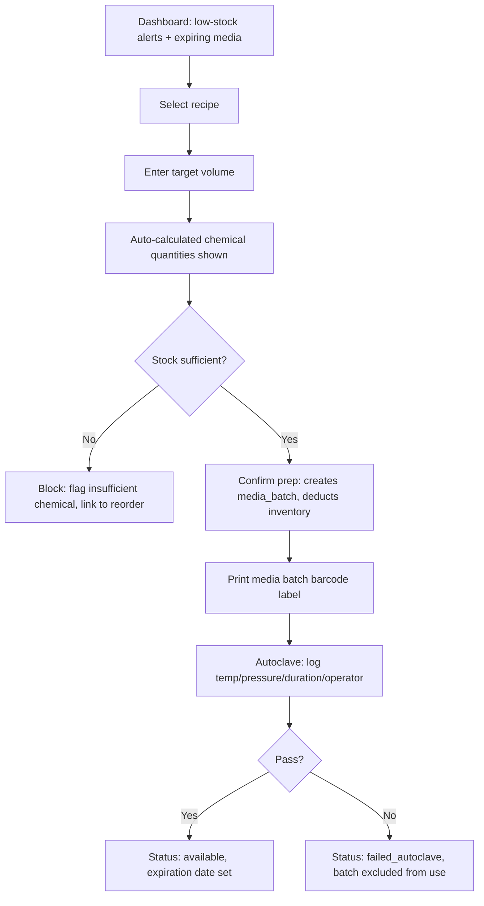
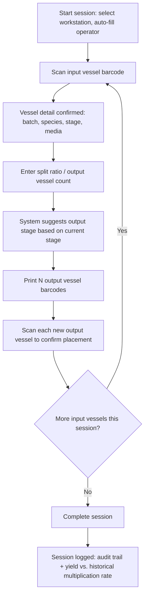
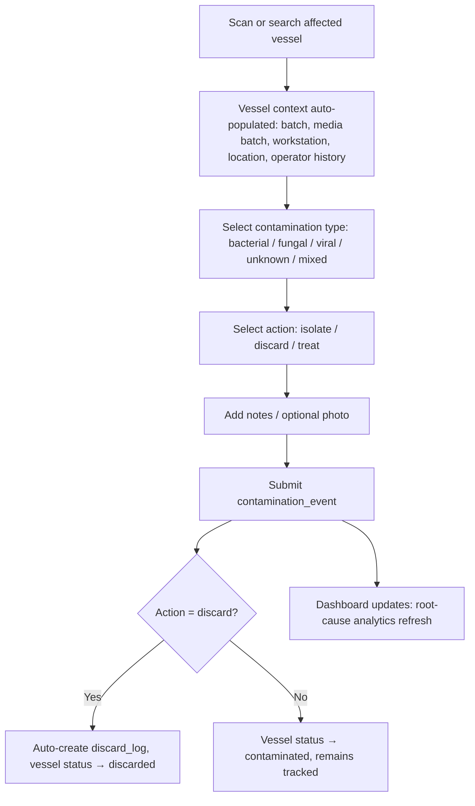

# UX Workflow Plan

Three core flows, designed mobile-first for tablets with attached/embedded barcode scanners used inside the cleanroom.

## A. Media Prep Flow (Media Prep Staff)

**Key screens**
1. **Recipe picker** — searchable list, shows basal media type and last-used date.
2. **Volume + calculation** — single numeric input drives a live-computed table (chemical, concentration, required qty, current stock, sufficient ✓/✗).
3. **Confirmation** — one tap commits the media batch and prints/generates the barcode label.
4. **Autoclave log** — form tied to the just-created batch; pass/fail gates whether the batch becomes usable.

## B. Subculturing Session Flow (Lab Technician, laminar flow hood)

**Key screens**
1. **Session start** — workstation dropdown (defaults to last used), operator auto-filled from login.
2. **Scan-in** — full-screen camera/scanner target; on match, shows a confirmation card (species, stage, days in culture, media batch) before proceeding — prevents acting on the wrong vessel.
3. **Split & output** — numeric split ratio input; live yield projection ("expected 8–12 vessels based on last 20 sessions for this species/stage").
4. **Label + scan-out** — batch-prints output labels; each is scanned once to confirm physical placement, closing the loop between the system and the physical jar.
5. **Session summary** — read-only recap before submit; edits require reopening.

## C. QC Contamination Logging Flow (Lab Technician / Lab Manager)

**Key screens**
1. **Scan/search** — same scan-first pattern as subculturing, so technicians never hand-type vessel IDs mid-contamination-response.
2. **Auto-populated context panel** — media batch, workstation, and preparing/operating staff are shown read-only, since these are exactly the dimensions root-cause analytics slice on.
3. **Type + action form** — minimal required taps; type and action are the two fields analytics depend on most.
4. **QC Analytics Dashboard** (Lab Manager+) — filterable charts: contamination rate by media batch, by workstation, by operator, by location, over time; flags outlier media batches (e.g., a single autoclave run correlating with a contamination spike) for investigation.

## Shared Interaction Principles

- **Scan-first, type-second** — every flow that touches a physical vessel starts with a scan; manual ID entry is a fallback, not the default.
- **Confirm-before-context** — after any scan, show a confirmation card of what was matched before allowing state-changing actions, to catch mis-scans.
- **Large touch targets, high contrast** — cleanroom tablets are often operated with gloved hands under bright task lighting.
- **Offline tolerance (Phase 2+)** — scan events queue locally and sync when connectivity returns, since cleanrooms/growth rooms may have poor Wi-Fi.
